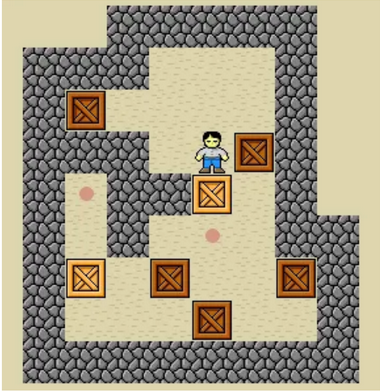

# auto-sokoban
A Sokoban game with auto resolution

## Table of content
- [auto-sokoban](#auto-sokoban)
  - [Table of content](#table-of-content)
  - [Getting started](#getting-started)
    - [Install](#install)
    - [Use](#use)
  - [Context](#context)
    - [Introduction](#introduction)
    - [Tasks](#tasks)
      - [Part 1 : Develop Sokoban game](#part-1--develop-sokoban-game)
      - [Part 2 : Automatic Sokoban solve](#part-2--automatic-sokoban-solve)
    - [Packages used](#packages-used)
  - [Product](#product)
    - [Desctiption](#desctiption)
    - [Features](#features)
      - [PLay game](#play-game)
      - [Solve game](#solve-game)
      - [Create Level](#create-level)
      - [Settings](#settings)
  - [Team](#team)

## Getting started
### Install
- Open git bash
- Clone the repository : `git clone https://github.com/christian-aucane/auto-sokoban.git`
- Move in the repo : `cd lingua-franca`
- Launch install.sh : `source scripts/install.sh`
### Use
- Open git bash
- Launch run.sh : `source scripts/run.sh`

## Context
### Introduction
- TODO : 
### Tasks
#### Part 1 : Develop Sokoban game
Build the game grid matrix and the graphic interface
- A button to cancel last move
- A button to reset the game
- Different levels of difficulty (more boxes, more walls, ...)
- A rating system saved in a database (resolution time or number of moves
moves to complete)
- Some music
- Sounds effects
- A button to quit game
  

#### Part 2 : Automatic Sokoban solve
Create an algrithm to solve automaticly grid
- Add a button to solve automaticly
- Display the game resolution step by step

### Packages used
- TODO : ajouter des images
- Pygame
- Numpy
- Pandas

## Product

### Desctiption
- TODO : Décrire l'app
### Features
- TODO : ajouter des scrennshoots
#### PLay game
#### Solve game
#### Create Level
#### Settings

## Team
- Christian Aucane  

- Pierre Mazard  

- Léo Carrey  
