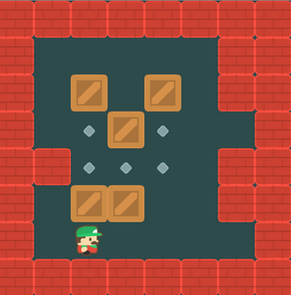
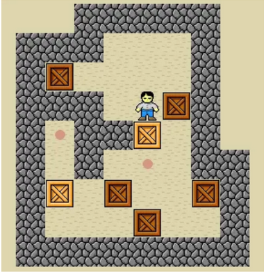
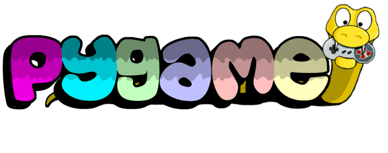
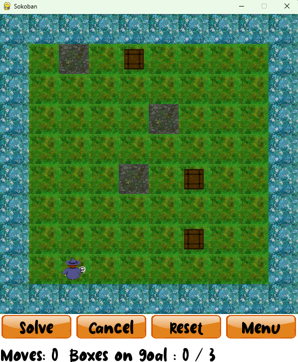
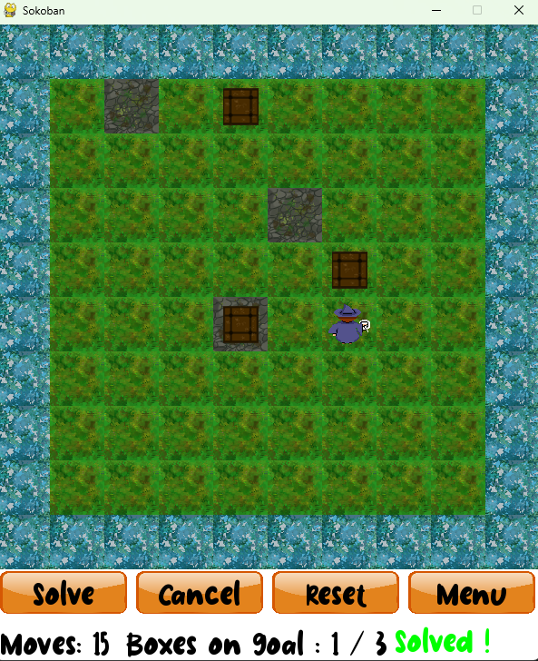
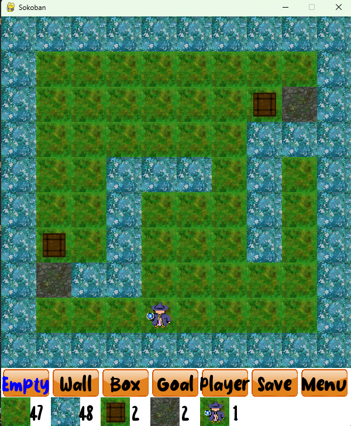
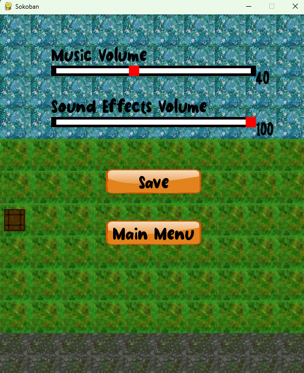

# auto-sokoban
A Sokoban game with auto resolution

## Table of content
- [auto-sokoban](#auto-sokoban)
  - [Table of content](#table-of-content)
  - [Context](#context)
    - [Introduction](#introduction)
    - [Tasks](#tasks)
      - [Part 1 : Develop Sokoban game](#part-1--develop-sokoban-game)
      - [Part 2 : Automatic Sokoban solve](#part-2--automatic-sokoban-solve)
  - [Getting started](#getting-started)
    - [Install](#install)
    - [Use](#use)
  - [Technos used](#technos-used)
  - [Project Files](#project-files)
  - [Product](#product)
    - [Desctiption](#desctiption)
    - [Features](#features)
      - [PLay game](#play-game)
      - [Solve game](#solve-game)
      - [Create Level](#create-level)
      - [Settings](#settings)
  - [Team](#team)


## Context
### Introduction


Sokoban is a puzzle game. The aim of this puzzle is to move boxes through a warehouse to a specific location.
The boxes can be pushed, but not pulled. The player must be careful and anticipate his movements to avoid not to jam a boxe against a wall or in a corner. A boxe can be placed on any any free space in the warehouse in the warehouse. Stowed can be moved again if the player needs to push it to a different needs to push it to a different location. 
The game ends when all the boxes have been placed in their designated their designated positions.

After our exciting sudoku and papyrus adventures, we're now turning our attention a new puzzle, the Sokoban! As our specialty is artificial intelligence, we decided to create a system for automatically solving Sokoban grids.

### Tasks
#### Part 1 : Develop Sokoban game
Build the game grid matrix and the graphic interface
- A button to cancel last move
- A button to reset the game
- Different levels of difficulty (more boxes, more walls, ...)
- A rating system saved in a database (resolution time or number of moves
moves to complete)
- Some music
- Sounds effects
- A button to quit game
  


#### Part 2 : Automatic Sokoban solve
Create an algrithm to solve automaticly grid
- Add a button to solve automaticly
- Display the game resolution step by step


## Getting started
### Install
- Open git bash
```bash
# Clone repository
git clone https://github.com/christian-aucane/auto-sokoban.git

# Move in the repository folder
cd auto-sokoban

# Create virtual environment and install dependancies
source scripts/install.sh
```

### Use
- Open git bash
```bash
# Activate virtual environment and run application
source scripts/run.sh
```

## Technos used
- 
- 
- 
- 


## Project Files
See `PROJECT_STRUCTURE.md` to see the project structure

## Product

### Desctiption


### Features
#### PLay game



#### Solve game



#### Create Level



#### Settings




## Team
- Christian Aucane <a href="https://github.com/christian-aucane"></a> <a href="https://www.linkedin.com/in/christian-aucane">  </a>

- Pierre Mazard <a href="https://github.com/pierre-mazard"></a> <a href="https://www.linkedin.com/in/pierre-mazard/"></a>

- Léo Carrey <a href="https://github.com/leo-carrey/"></a> <a href="https://www.linkedin.com/in/leo-carrey/"></a>
